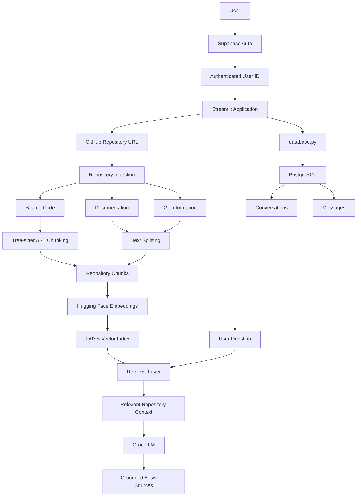

# 🧠 Codebase QA Assistant

> **An AI-powered codebase companion that lets you understand a GitHub repository through natural-language questions.**

[](https://www.python.org/)
[](https://streamlit.io/)
[](https://www.langchain.com/)
[](https://github.com/facebookresearch/faiss)
[](https://supabase.com/)
[](https://groq.com/)

---

## 🚀 Overview

**Codebase QA Assistant** turns a public GitHub repository into a searchable knowledge base and lets users ask questions about its implementation, documentation, architecture, and available Git information.

Instead of sending an entire repository to an LLM, the application **ingests the repository, creates meaningful code/document chunks, generates embeddings, retrieves relevant context, and then uses an LLM to generate a grounded answer with source files.**

The application also includes **Supabase Authentication** and **PostgreSQL-backed private conversation history**, so each authenticated user has their own chat history.

---

## ✨ What It Does

- 🔐 **Authentication** — Email/password signup and login with Supabase Auth
- 🐙 **GitHub Analysis** — Clone and process public repositories
- 🧩 **AST-aware Code Chunking** — Preserve meaningful functions, methods, and classes
- 📚 **Documentation Ingestion** — Process Markdown and text documentation
- 🌳 **Git Information** — Extract available commit metadata
- 🤗 **Local Embeddings** — `sentence-transformers/all-MiniLM-L6-v2`
- ⚡ **FAISS Retrieval** — Fast local vector similarity search
- 🔎 **Hybrid Retrieval Logic** — Project overview, keywords, exact code symbols, and semantic search
- 🤖 **RAG with Groq** — Generate repository-grounded answers
- 📄 **Source References** — Show the files used for an answer
- 💬 **Persistent Chats** — Save and reopen previous conversations
- 👤 **User-specific History** — Conversations are isolated by authenticated user ID
- ☁️ **Streamlit Deployment** — Designed for Streamlit Community Cloud

---

## 🏗️ Architecture



### End-to-end flow

```text
GitHub URL
   ↓
Repository Ingestion
   ↓
Code / Docs / Git Information
   ↓
AST-aware + Text Chunking
   ↓
Hugging Face Embeddings
   ↓
FAISS Vector Index
   ↓
User Question
   ↓
Retrieval
   ↓
Relevant Repository Context
   ↓
Groq LLM
   ↓
Grounded Answer + Sources
```

Conversation persistence runs alongside the application:

```text
Supabase Auth
   ↓
User ID
   ↓
database.py
   ↓
PostgreSQL
   ↓
Private Conversations + Messages
```

---

## 🧠 RAG Pipeline

The application follows a **Retrieval-Augmented Generation (RAG)** approach.

### 1. Ingestion

The repository is cloned locally using GitPython. Relevant source-code files, documentation, and available Git commit information are extracted.

### 2. Chunking

Code and documentation are processed differently.

**Code:** Tree-sitter parses supported languages and extracts meaningful AST structures such as functions, methods, classes, and related definitions.

**Documentation:** Markdown and text files are split using a recursive text splitter.

The root `README.md` receives higher source priority because it commonly contains project-level information.

### 3. Embeddings

Each chunk is converted into a vector using:

```text
sentence-transformers/all-MiniLM-L6-v2
```

The model runs locally, so embedding generation does not require a Hugging Face API key.

### 4. Retrieval

For each question, the retrieval layer can use:

- Project overview retrieval
- Keyword matching
- Exact code-symbol/function matching
- FAISS semantic similarity search
- Duplicate reduction
- Source prioritization

### 5. Generation

The retrieved chunks are combined into a context and sent to the Groq LLM.

Current model:

```text
openai/gpt-oss-20b
```

The model is instructed to answer using the supplied repository context and avoid inventing unsupported information.

---

## 🔐 Authentication & Private Chat History

Supabase is used for **authentication**, while PostgreSQL is used for **persistent application data**.

```text
User
 ↓
Supabase Auth
 ↓
Unique User ID
 ↓
Streamlit Session
 ↓
database.py
 ↓
PostgreSQL
```

Each conversation is associated with the authenticated user's ID.

The database contains two main tables:

```text
conversations
├── id
├── user_id
├── title
├── repository_url
└── created_at

messages
├── id
├── conversation_id
├── role
├── content
├── source_files
└── created_at
```

A conversation can contain multiple messages:

```text
User
 └── Conversation
      ├── User Message
      ├── Assistant Message
      ├── User Message
      └── Assistant Message
```

Database queries filter by `user_id`, so one authenticated user cannot retrieve another user's conversation history through the application's database operations.

### Supabase + PostgreSQL

Supabase is the backend platform hosting the project's PostgreSQL database.

The project uses two connections:

- **Supabase Python client** → Authentication and user identity
- **psycopg2** → Direct PostgreSQL connection for conversations/messages

So:

```text
Supabase Auth
     ↓
   User ID
     ↓
PostgreSQL
     ↓
Chat History
```

---

## 🛠️ Tech Stack

| Technology | Role |
|---|---|
| **Python** | Core application |
| **Streamlit** | Web UI and deployment |
| **GitPython** | Repository cloning and Git operations |
| **Tree-sitter** | AST-based code parsing |
| **Tree-sitter Language Pack** | Multi-language parser support |
| **LangChain** | Document/vector-store integration |
| **Sentence Transformers** | Local embedding generation |
| **Hugging Face** | Embedding model ecosystem |
| **FAISS** | Vector similarity search |
| **Groq** | LLM inference |
| **Supabase Auth** | User authentication |
| **PostgreSQL** | Persistent conversation storage |
| **psycopg2** | PostgreSQL connectivity |
| **python-dotenv** | Local environment configuration |

### Core AI Components

**Embedding model**
```text
sentence-transformers/all-MiniLM-L6-v2
```

**LLM**
```text
openai/gpt-oss-20b
```

---

## 📂 Project Structure

```text
Codebase-QA-Assistant/
│
├── app.py                  # Streamlit UI, authentication and app flow
├── ingestion.py            # Repository ingestion
├── chunking.py             # AST-aware and text-based chunking
├── vector_store.py         # Embeddings + FAISS index
├── retrieval.py            # Repository retrieval logic
├── RAG.py                  # Context building + LLM generation
├── database.py             # PostgreSQL operations
│
├── requirements.txt        # Python dependencies
├── README.md               # Project documentation
├── .gitignore              # Ignored files and secrets
│
└── .env                    # Local secrets (not committed)
```

### Generated locally during analysis

```text
repo/
faiss_index/
repo_state.json
```

These generated resources are intentionally excluded from Git.

---

## ⚙️ Local Setup

### 1. Clone

```bash
git clone https://github.com/prachishr/codebase-qa-assistant.git
cd codebase-qa-assistant
```

### 2. Create a virtual environment

```bash
python -m venv .venv
```

Windows:

```powershell
.venv\Scripts\activate
```

### 3. Install dependencies

```bash
pip install -r requirements.txt
```

### 4. Configure environment variables

Create `.env`:

```env
GROQ_API_KEY=your_groq_api_key
SUPABASE_URL=your_supabase_project_url
SUPABASE_KEY=your_supabase_key
DB_PASSWORD=your_database_password
```

> Never commit `.env`, API keys, or database passwords.

### 5. Run

```bash
streamlit run app.py
```

Open:

```text
http://localhost:8501
```

---

## 🔑 Supabase Configuration

For authentication, create a Supabase project and enable email/password authentication.

Configure the authentication Site URL / Redirect URLs for your local and deployed Streamlit application.

For local development:

```text
http://localhost:8501
```

For production, use the deployed Streamlit application URL.

The application's Supabase credentials should be provided through environment variables locally and Streamlit Secrets when deployed.

---

## ☁️ Deployment

The application is designed to run on **Streamlit Community Cloud**.

Typical deployment flow:

```text
GitHub
  ↓
Streamlit Community Cloud
  ↓
Install requirements.txt
  ↓
Configure Secrets
  ↓
Run app.py
```

Example Streamlit secrets:

```toml
GROQ_API_KEY = "your_groq_api_key"
SUPABASE_URL = "your_supabase_project_url"
SUPABASE_KEY = "your_supabase_key"
DB_PASSWORD = "your_database_password"
```

---

## 💬 Example Questions

After analyzing a repository, users can ask:

```text
What is this project about?
```

```text
Explain the project architecture.
```

```text
How does the loadRules function work?
```

```text
How does contextMessages work?
```

```text
Which file handles authentication?
```

```text
What are the installation instructions?
```

```text
Which technologies are used in this repository?
```

```text
Where is the database connection created?
```

---

## ⚡ Why These Technologies?

| Choice | Why |
|---|---|
| **RAG** | Grounds LLM answers in the actual repository |
| **Tree-sitter / AST** | Preserves meaningful code structures during chunking |
| **MiniLM embeddings** | Lightweight local semantic representation |
| **FAISS** | Fast, local vector similarity search |
| **Groq** | Fast LLM inference |
| **PostgreSQL** | Reliable persistent relational storage |
| **Supabase Auth** | Managed authentication and stable user identities |
| **Streamlit** | Simple Python-based application and deployment |

### Why FAISS instead of ChromaDB?

ChromaDB was initially explored for vector storage, but the Windows environment encountered a `cygrpc` DLL loading issue caused by an Application Control policy.

FAISS provided a simpler local vector-search implementation without the problematic gRPC dependency, so the project was moved to FAISS.

---

## 🔒 Security

- Authentication is handled by Supabase Auth.
- Conversation queries use the authenticated user's ID.
- API keys and database credentials are stored outside source code.
- `.env` and Streamlit secrets are excluded from Git.
- Generated repository/vector files are excluded from Git.
- Database operations verify conversation ownership where required.

> The application currently analyzes public GitHub repositories. Private repository access through GitHub OAuth/token integration is not yet implemented.

---

## ⚠️ Current Limitations

- Public GitHub repositories are currently supported.
- Repository cloning uses `depth=1` for faster ingestion and deployment reliability.
- Full Git history is therefore not currently available.
- Very large repositories may require additional processing time.
- The repository and FAISS workspace currently use local application paths.
- Concurrent multi-user repository analysis would benefit from per-user workspace isolation.

---

## 🔮 Future Improvements

- GitHub OAuth and private repository support
- Full Git history analysis
- Per-user repository and FAISS workspace isolation
- Hybrid keyword + vector retrieval with reranking
- Repository dependency visualization
- More programming language support
- Streaming LLM responses
- Background repository indexing
- Persistent vector indexes
- Improved code/source highlighting

---

## 📌 Project Highlights

This project demonstrates practical implementation of:

**Generative AI • RAG • LLMs • Semantic Search • Embeddings • Vector Search • AST Parsing • Code Intelligence • GitHub Analysis • PostgreSQL • Authentication • Multi-user Data Isolation • Streamlit Deployment**

---

## 👩‍💻 Author

**Prachi Shrivastava**

GitHub:  
https://github.com/prachishr/codebase-qa-assistant

---

## ⭐ Support

If you found this project useful, consider giving the repository a ⭐ on GitHub.
